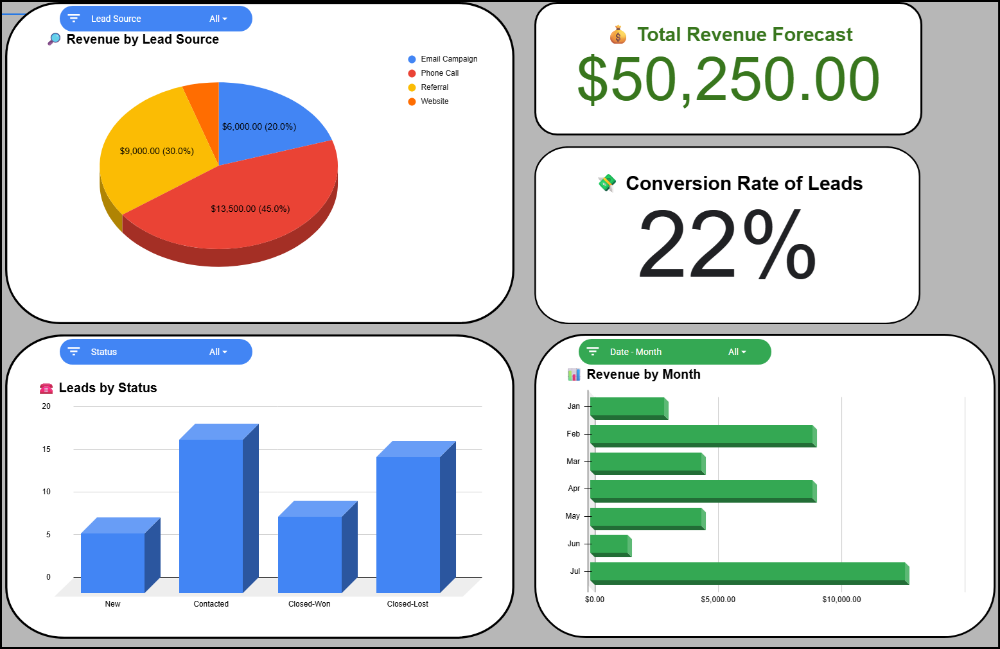
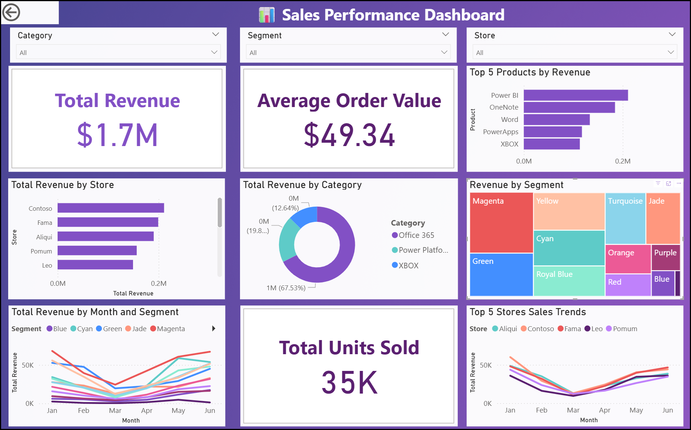

# Sales Performance Dashboard (Power BI)

**What it is:** An executive-style Power BI dashboard built from Microsoft’s Financial Sample dataset showing revenue KPIs, product mix, store performance, and monthly trends.

## Highlights
- KPI cards: **Total Revenue, Average Order Value, Total Units Sold**
- Breakdowns: **Revenue by Store**, **Top 5 Products**, **Revenue by Category**, **Revenue by Segment**
- Trends: **Monthly revenue**, optional **Top 4 Store line comparison**
- Interactive slicers: **Category, Segment, Store**

## Why it matters
- Shows how I design clear, decision-focused layouts
- Uses reusable **DAX measures** and a star-schema model
- Demonstrates best practices: themes, alignment, clean tooltips, Top N focus

## Tech
- Power BI Desktop
- DAX measures: `Total Revenue`, `Total Units Sold`, `Average Order Value`

## Screenshots

## File
- `PowerBI_SalesPerformance.pbix` (open in Power BI Desktop)

*If you want the interactive version, contact me for a live walkthrough or a hosted link.*
